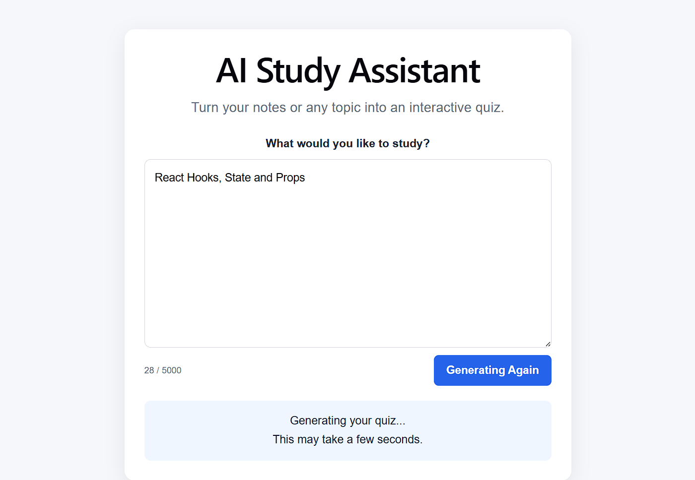
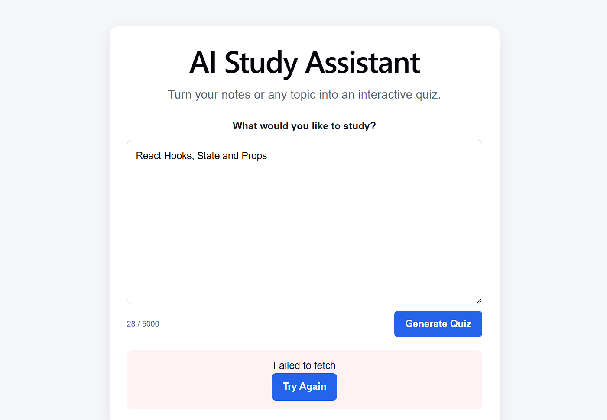
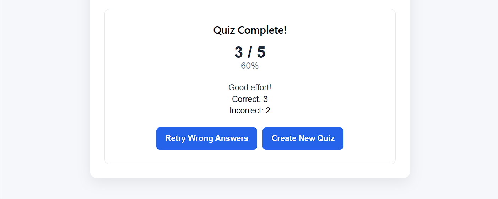

# AI Study Assistant

An AI-powered study assistant that helps students learn from their study material, ask questions, and get AI-generated explanations. The project focuses on making studying more interactive by combining a modern web interface with AI-powered assistance.

## Features

* **AI-Powered Study Assistance** – Ask questions and receive AI-generated answers and explanations.
* **Interactive Chat Interface** – Communicate with the study assistant through a conversational interface.
* **Study Support** – Get explanations for difficult concepts and topics.
* **Responsive UI** – Access the application across desktop and mobile screen sizes.
* **Real-Time AI Responses** – Send prompts and receive responses dynamically through the application.
* **Simple User Experience** – Designed to provide a focused interface for students without unnecessary complexity.

## Tech Stack

### Frontend

* **React.js** – Builds the interactive user interface and manages application components.
* **JavaScript** – Handles application logic and user interactions.
* **HTML5 & CSS3** – Provides the application structure and responsive styling.

### Backend / AI Integration

* **Node.js** – Provides the server-side runtime for backend functionality.
* **Express.js** – Handles backend routes and communication between the frontend and AI service.
* **Gemini API** – Provides AI-powered responses and study assistance.

### Development Tools

* **Git & GitHub** – Version control and source-code management.
* **Render** – Used for deployment of the application.

## Architecture

```text
                    ┌─────────────────────┐
                    │       Student       │
                    └──────────┬──────────┘
                               │
                               ▼
                    ┌─────────────────────┐
                    │   React Frontend    │
                    │                     │
                    │  Chat Interface     │
                    │  Study UI           │
                    └──────────┬──────────┘
                               │
                         HTTP / API
                               │
                               ▼
                    ┌─────────────────────┐
                    │   Express / Node.js │
                    │                     │
                    │  API Routes         │
                    │  Request Handling   │
                    └──────────┬──────────┘
                               │
                         API Request
                               │
                               ▼
                    ┌─────────────────────┐
                    │     Gemini API      │
                    │                     │
                    │  AI Processing      │
                    │  Generated Answer   │
                    └──────────┬──────────┘
                               │
                         AI Response
                               │
                               ▼
                    ┌─────────────────────┐
                    │   React Frontend    │
                    │                     │
                    │ Display Response    │
                    └─────────────────────┘
```

## Project Structure

```text
AI-Study-Assistant/
│
├── client/
│   ├── src/
│   │   ├── components/
│   │   │   └── ...
│   │   ├── App.jsx
│   │   ├── main.jsx
│   │   └── ...
│   ├── public/
│   ├── package.json
│   └── ...
│
├── server/
│   ├── routes/
│   │   └── ...
│   ├── controllers/
│   │   └── ...
│   ├── server.js
│   ├── package.json
│   └── .env
│
├── .gitignore
└── README.md
```

> Update the structure above if your repository uses different folder or file names.

### Major Components

| Component      | Responsibility                            |
| -------------- | ----------------------------------------- |
| `client/`      | Contains the React frontend               |
| `src/`         | Frontend application source code          |
| `components/`  | Reusable UI components                    |
| `server/`      | Backend application                       |
| `routes/`      | Backend API routes                        |
| `controllers/` | Request and response handling             |
| `.env`         | Stores environment-specific configuration |
| `README.md`    | Project documentation                     |

## Installation & Setup

### Prerequisites

Make sure the following are installed:

* Node.js
* npm
* Git
* Gemini API key

### 1. Clone the Repository

```bash
git clone <YOUR_GITHUB_REPOSITORY_URL>

cd AI-Study-Assistant
```

### 2. Install Frontend Dependencies

```bash
cd client
npm install
```

### 3. Install Backend Dependencies

Open another terminal:

```bash
cd server
npm install
```

### 4. Configure Environment Variables

Create a `.env` file inside the backend directory.

```env
GEMINI_API_KEY=your_gemini_api_key
PORT=5000
```

Never commit your API key to GitHub.

Make sure `.env` is included in `.gitignore`:

```text
.env
node_modules/
```

### 5. Start the Backend

```bash
cd server
npm start
```

If your project uses nodemon:

```bash
npm run dev
```

### 6. Start the Frontend

```bash
cd client
npm run dev
```

The terminal will provide the local development URL, commonly:

```text
http://localhost:5173
```

## Usage

1. Start the backend server.
2. Start the React frontend.
3. Open the application in your browser.
4. Enter a study-related question or topic.
5. Submit the question.
6. The frontend sends the request to the backend.
7. The backend communicates with the Gemini API.
8. The AI-generated response is returned to the application.
9. The response is displayed in the study assistant interface.

### Example

```text
Student:
Explain recursion in simple terms.

AI Study Assistant:
Recursion is a programming technique where a function
calls itself to solve smaller versions of the same problem...
```

## Screenshots / Demo

### Live Demo

[View Live Demo](https://ai-study-assistant-five-mocha.vercel.app/)

### Application Preview








```


## Engineering Decisions

### React for the Frontend

React was used to create a component-based user interface. This makes the chat interface easier to organize and allows individual UI components to be reused and maintained independently.

### Node.js and Express

Node.js and Express provide the backend layer between the frontend and the AI service. Keeping the AI API communication on the backend helps avoid exposing sensitive API credentials directly in the browser.

### AI API Integration

The Gemini API is used to generate responses to user questions. The backend receives the user's prompt, sends it to the AI service, and returns the generated response to the frontend.

### Environment Variables

API credentials and configuration values are stored using environment variables rather than hardcoding them into the source code.

### Deployment

The application can be deployed using a cloud hosting platform such as Render, allowing the project to be accessed without running it locally.

## Testing

The application should be tested for:

* Frontend rendering
* User input handling
* API request/response flow
* AI response generation
* Invalid or empty input
* Backend errors
* Responsive UI behavior
* Environment variable configuration

### Manual Testing

Start the frontend and backend locally and verify the complete flow:

```text
User Input
    ↓
Frontend
    ↓
Backend API
    ↓
Gemini API
    ↓
Backend Response
    ↓
Frontend Display
```

If automated tests are added later, document the test framework and commands here.

## Limitations

* AI-generated responses may occasionally contain incorrect or incomplete information.
* The quality of responses depends on the prompt and the AI model.
* The application requires access to the configured AI API.
* API usage may be subject to provider rate limits or quotas.
* The current version may not include advanced features such as persistent study history, progress tracking, or personalized learning paths.

## Future Improvements

Potential improvements include:

* **Study History** – Store previous questions and AI responses.
* **Personalized Learning** – Recommend topics based on a student's learning activity.
* **Quiz Generation** – Automatically generate quizzes from study topics.
* **Progress Tracking** – Track completed topics and learning progress.
* **PDF / Document Support** – Allow students to upload study material and ask questions about it.
* **Authentication** – Add secure user accounts and personalized profiles.
* **AI-Powered Summaries** – Generate summaries and important points from study material.
* **Flashcard Generation** – Automatically create flashcards from learning content.
* **Improved Error Handling** – Provide clearer feedback when API requests fail.

## Environment Variables

| Variable         | Description                                  |
| ---------------- | -------------------------------------------- |
| `GEMINI_API_KEY` | API key used to access the Gemini AI service |
| `PORT`           | Port used by the backend server              |

## Contributing

Contributions are welcome.

```bash
git checkout -b feature/your-feature
```

Make your changes, test them locally, and create a pull request.

## License

This project is intended for educational and portfolio purposes.
